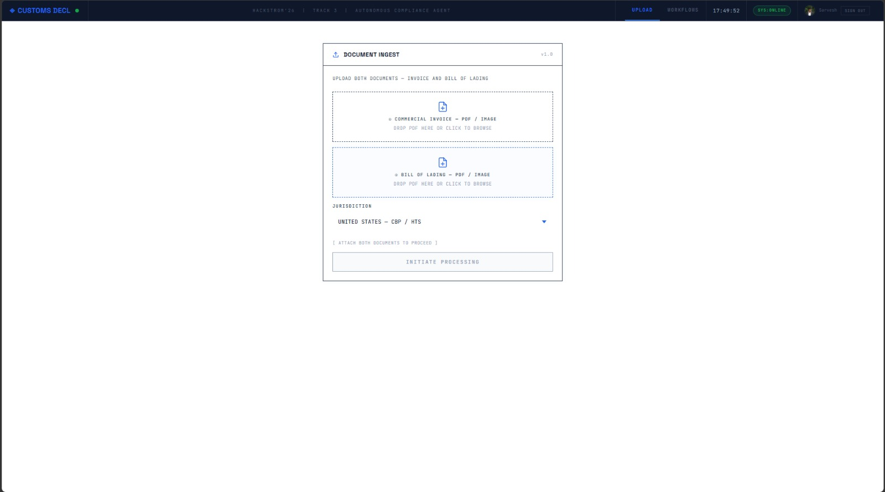
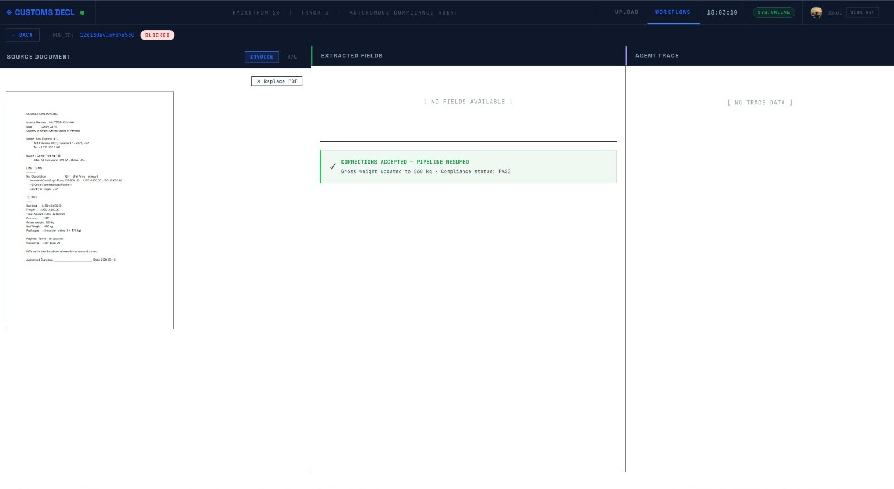

# Trust Flow: Autonomous Customs Compliance Orchestrator

**Hackstrom '26 | Track 3 | Autonomous Compliance Agent**

Trust Flow is an enterprise-grade agentic AI framework designed to automate the reconciliation and validation of international trade documentation. By leveraging advanced Large Language Models (LLMs) and structured layout analysis, the system identifies discrepancies in Commercial Invoices and Bills of Lading before they impact the supply chain.

## Overview
Manual document verification in logistics is prone to high error rates and operational bottlenecks. Trust Flow addresses this by implementing a deterministic, Multi-Agent System (MAS) that performs cross-document validation, HS code classification, and regulatory compliance auditing.



## Core Capabilities
- **Agentic Reconciliation**: A multi-node LangGraph pipeline that cross-references data points (Gross Weight, Vessel Names, Dates) across disparate document types.
- **Deep Layout Extraction**: Integrated with Docling for high-fidelity OCR and structured data extraction from complex PDF layouts.
- **Human-in-the-Loop (HITL)**: Automated pipeline interruption for manual override when critical discrepancies are detected.
- **Regulatory Compliance**: Integrated with USITC HTS REST APIs for real-time Harmonized System code verification.

## Architecture and Workflow
The system orchestrates a series of specialized nodes to ensure data integrity:
1. **Ingestion Node**: Atomic upload of document pairs to encrypted storage.
2. **Extraction Node**: LLM-driven field extraction into strict Pydantic models.
3. **Validation Node**: Rules-based engine for deterministic delta calculations.
4. **Audit Node**: Generation of a comprehensive audit trail for customs transparency.



## Technical Architecture
- **Frontend**: React-based dashboard with a Bloomberg-optimized UI for high-density data monitoring.
- **Backend**: FastAPI orchestrator utilizing SQLModel for persistent state management.
- **Processing**: Distributed task execution via Celery and Redis.
- **Observability**: Centralized logging and metrics via Grafana and Loki.

## Installation and Deployment

### Prerequisites
- Docker and Docker Compose
- Groq API credentials
- Firebase Authentication configuration

### Launch Procedure
1. Configure environment variables in the root `.env` file.
2. Execute the deployment command:
   ```bash
   docker-compose up -d --build
   ```
3. Access the dashboard via `http://localhost:3000`.

*Note: For manual testing and demo scripts, please refer to the `/scripts` directory.* [start_demo.bat](scripts/start_demo.bat)

## Maintainability and Scaling
Trust Flow adheres to the following software engineering best practices:
- **Singleton Database Connectivity**: Optimized resource management for SQLite sessions.
- **MVC Architecture**: Clear separation between data models, business logic orchestration, and the user interface.
- **Resource Management**: Core business rules and test datasets are partitioned in the `/resources` directory.
- **Modular Scaling**: Independent scaling of AI Workers based on document throughput.
